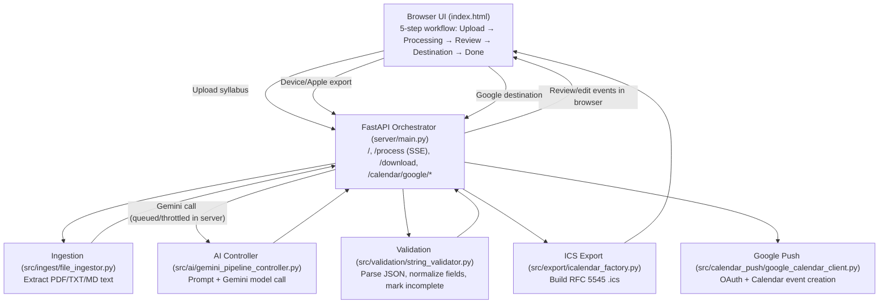

<div align="center">

# 📚 Syllabus to Calendar

### *Turn course syllabi into organised, editable calendar events with AI*

<p>
  
  
  
  
  
</p>

<p>
  <strong>Syllabus to Calendar</strong> extracts exams, quizzes, assignments, projects, and other academic deadlines from PDF, TXT, or Markdown syllabi. Users can review and edit the extracted events, download a universal <code>.ics</code> calendar file, or optionally push the events directly into a dedicated Google Calendar.
</p>

</div>

---

## 📋 Table of Contents

- [✨ Highlights](#-highlights)
- [🔄 How It Works](#-how-it-works)
- [🏛️ Architecture Overview](#️-architecture-overview)
- [🧭 User Flow](#-user-flow)
- [🛠️ Tech Stack](#️-tech-stack)
- [🏗️ Project Structure](#️-project-structure)
- [🚀 Local Setup](#-local-setup)
- [🔐 Configuration](#-configuration)
- [🌐 API Reference](#-api-reference)
- [☁️ Deployment](#️-deployment)
- [🧠 Design Decisions](#-design-decisions)
- [🗺️ Roadmap](#️-roadmap)
- [🤝 Contributing](#-contributing)
- [📄 License](#-license)

---

## ✨ Highlights

- **AI-powered syllabus extraction** using Google Gemini to identify academic deadlines from unstructured course documents.
- **Multiple input formats** with support for PDF, TXT, and Markdown files.
- **Privacy-conscious processing** where uploaded files are processed in memory by the web pipeline instead of being saved to disk.
- **Live processing updates** delivered through Server-Sent Events rather than a simulated progress bar.
- **Editable review stage** so users can correct incomplete or incorrectly extracted course names, task names, dates, times, or descriptions.
- **Manual event creation** for deadlines that are not present in a syllabus or need to be added separately.
- **Universal calendar export** through RFC 5545-compatible `.ics` files for Apple Calendar, Outlook, Yahoo Calendar, Windows Calendar, Thunderbird, and other calendar applications.
- **Optional Google Calendar integration** using OAuth 2.0 and the restricted `calendar.app.created` scope.
- **Dedicated Google calendar per visitor** named `Syllabus Deadlines`, keeping the user's existing calendars untouched.
- **Session-scoped credentials** held in memory and associated with opaque visitor session IDs.
- **Gemini concurrency and rate limiting** with an in-process semaphore and sliding per-minute window to protect the shared API key.
- **Graceful partial-data handling** where incomplete events are flagged for review instead of causing the entire extraction batch to fail.
- **Single-origin architecture** with FastAPI serving both the backend API and the static `index.html` frontend.
- **Deployment-ready configuration** for Render, with a `render.yaml` Blueprint and a portable `Procfile`.

> **Important:** The Gemini API key is required for syllabus extraction. Google Calendar OAuth is optional; Device/Other and Apple Calendar exports work through `.ics` files without Google setup.

---

## 🔄 How It Works

```text
Upload a syllabus or add an event manually
                ↓
Extract text locally
(PDF via PyMuPDF, TXT/MD via UTF-8 read)
                ↓
Send syllabus text to Google Gemini
                ↓
Receive structured JSON event data
                ↓
Validate and normalize fields
(dates → YYYY-MM-DD, times → HH:MM)
                ↓
Review and edit events in the browser
                ↓
Choose a destination
(Device / Apple → .ics download, Google → OAuth push)
                ↓
Calendar events are ready to use
```

The web pipeline is coordinated by `server/main.py`. It validates the upload, extracts text through `src/ingest/file_ingestor.py`, calls Gemini through `src/ai/gemini_pipeline_controller.py`, normalizes the model response with `src/validation/string_validator.py`, and returns the result to the frontend as streamed events.

---

## 🏛️ Architecture Overview

Mark Calendar uses a **single-origin architecture**: one FastAPI service (`server/main.py`) serves both the browser app (`index.html`) and backend API endpoints. This keeps the frontend/backend boundary simple (same host, same session cookie scope) while still separating responsibilities by runtime layer.



### Runtime layers and responsibilities

- **`index.html` (browser UI):** Implements the five-step flow (Upload, Processing, Review & Edit, Choose Calendar, Done), opens `/process` SSE, lets users fix extracted rows, and posts reviewed events to export/push endpoints.
- **`server/main.py` (orchestrator/API):** Serves `index.html`, validates uploads, runs the extraction pipeline, streams live phase/result/error updates over SSE, manages session IDs/cookies, throttles Gemini calls (concurrency + per-minute rate window), and exposes Google Calendar OAuth/push routes.
- **`src/ingest/file_ingestor.py` (ingestion):** Extracts text from syllabus files in memory (`.pdf` via PyMuPDF, `.txt`/`.md` via UTF-8 decode/read).
- **`src/ai/gemini_pipeline_controller.py` (AI adapter):** Builds the strict extraction prompt and executes Gemini model requests (injected client or SDK path). Concurrency/rate limits are enforced by `server/main.py` around these calls.
- **`src/validation/string_validator.py` (normalization):** Isolates/parses model JSON, normalizes date/time fields, and marks malformed/missing rows as `incomplete` so one bad row does not fail the full batch.
- **`src/export/icalendar_factory.py` (calendar export):** Converts reviewed events into RFC 5545-compliant `.ics` text used for Device/Apple downloads.
- **`src/calendar_push/google_calendar_client.py` (Google integration):** Handles OAuth flow, session-bound credential storage, dedicated calendar lookup/creation, and Google Calendar event insertion.

### End-to-end request/data flow

1. User uploads a syllabus in the browser (`index.html`).
2. `POST /process` in `server/main.py` validates file type/size/content.
3. `file_ingestor.py` extracts plain text from file bytes.
4. `GeminiPipelineController` sends a structured prompt to Gemini and returns raw model output.
5. `string_validator.py` parses/normalizes events and flags incomplete entries.
6. Server streams results back via SSE; user reviews/edits events in the browser.
7. User chooses output:
   - **Device/Apple:** browser sends events to `/download`, which calls `build_ics()` and returns a downloadable `.ics`.
   - **Google Calendar:** OAuth/session routes establish connection, then `/calendar/google/push` calls `google_calendar_client.push_events()`.

### Operational characteristics

- **In-memory processing:** Uploaded file contents are processed from memory (not persisted as user data), and there is **no database** in the current architecture.
- **Session-scoped credentials:** Google OAuth tokens are kept in in-memory per-session buckets keyed by signed session IDs.
- **Deployment model:** The same FastAPI app is deployed as one web process (see `Procfile`) and is configured for Render via `render.yaml`.

---

## 🧭 User Flow

The frontend in `index.html` provides a five-step workflow:

| Step | Experience |
| --- | --- |
| **1. Upload** | Drag and drop or select a PDF, TXT, or Markdown syllabus. Files are limited to 20 MB. Users can also create an event manually. |
| **2. Processing** | Watch real-time extraction, Gemini analysis, queue, and validation status as Server-Sent Events arrive from `/process`. |
| **3. Review & Edit** | Inspect every extracted event and edit the course, task, date, time, or description. Incomplete events are clearly marked. |
| **4. Choose Calendar** | Select Google Calendar, Apple Calendar, or Device/Other as the destination. |
| **5. Done** | View a destination-specific confirmation, download the calendar file, or see the Google Calendar push result. |

### Supported destinations

#### Device / Other

The default option requires no authentication. The app downloads a calendar file that can be imported into most calendar applications.

#### Apple Calendar

Apple Calendar uses the same `.ics` export path. Open the downloaded file on macOS or iOS to import the events.

#### Google Calendar

Google Calendar is an optional direct-push integration. After OAuth setup, events are created in a dedicated `Syllabus Deadlines` calendar using the restricted `calendar.app.created` scope. The app does not list, read, or modify the user's existing calendars.

---

## 🛠️ Tech Stack

| Layer | Technology | Role |
| --- | --- | --- |
| Language | [Python](https://www.python.org/) | Application logic, CLI, backend orchestration, extraction, validation, and export |
| Web framework | [FastAPI](https://fastapi.tiangolo.com/) | Async HTTP API, file uploads, streaming responses, and OAuth routes |
| ASGI server | [Uvicorn](https://www.uvicorn.org/) | Runs the FastAPI application locally and in production |
| AI provider | [Google Gemini](https://ai.google.dev/) via `google-genai` | Converts syllabus text into structured academic events |
| PDF extraction | [PyMuPDF](https://pymupdf.readthedocs.io/) | Extracts text from PDF files without an external document service |
| Calendar export | RFC 5545 iCalendar format | Produces portable `.ics` calendar files |
| Google integration | Google Calendar API + OAuth 2.0 | Pushes events into a dedicated user calendar |
| Frontend | Vanilla HTML, CSS, and JavaScript | Five-step browser workflow with no frontend build step |
| Styling | Tailwind CSS CDN | Utility-first styling loaded directly by `index.html` |

### Notable dependencies

- `pymupdf` — local PDF text extraction
- `google-genai` — Gemini model access
- `fastapi` — asynchronous backend framework
- `python-multipart` — multipart file uploads
- `google-api-python-client` — Google Calendar API operations
- `google-auth-oauthlib` — OAuth 2.0 authorization flow
- `itsdangerous` — signed session cookie support
- `tzlocal` — local timezone detection for Google Calendar events

---

## 🏗️ Project Structure

```text
Mark-Calender/
├── README.md                              # Project overview, setup, and architecture notes
├── DEPLOYMENT.md                          # Render and hosted multi-user deployment guide
├── FRONTEND_GUIDE.md                      # Detailed five-step frontend user guide
├── requirements.txt                       # Python dependencies
├── Procfile                               # Portable production start command
├── render.yaml                            # Render Blueprint configuration
├── index.html                             # Complete vanilla JS + Tailwind CDN frontend
├── main.py                                # CLI pipeline runner
├── mock_response.py                       # Sample Gemini response for local pipeline testing
├── test_payload.json                      # Example event payload for API testing
├── sample_syllabus.txt                    # Plain-text sample syllabus
├── sample_syllabus.pdf                    # PDF sample syllabus
├── output.ics                             # Example generated calendar output
├── generate_phase_plan.py                 # One-shot project roadmap PDF generator
├── SyllabusCalendar_PhasePlan.pdf         # Generated development phase plan
├── server/
│   ├── __init__.py
│   └── main.py                            # FastAPI app and request orchestration
└── src/
    ├── __init__.py
    ├── ai/
    │   ├── __init__.py
    │   └── gemini_pipeline_controller.py  # Prompt construction and Gemini calls
    ├── calendar_push/
    │   ├── __init__.py
    │   └── google_calendar_client.py      # Google OAuth and Calendar API integration
    ├── export/
    │   ├── __init__.py
    │   └── icalendar_factory.py            # RFC 5545 calendar generation
    ├── ingest/
    │   ├── __init__.py
    │   └── file_ingestor.py                # PDF, TXT, and Markdown ingestion
    └── validation/
        ├── __init__.py
        └── string_validator.py             # JSON parsing, field normalization, validation
```

### How it fits together

`server/main.py` serves `index.html` at `/` and exposes the application API. The `/process` endpoint validates the uploaded file, extracts its contents, waits for a Gemini slot, calls the model, sanitizes the returned JSON, and streams phase/result/error messages back to the browser.

The browser keeps the extracted events editable. When the user chooses Device or Apple, `/download` passes the edited events to `build_ics()` in `src/export/icalendar_factory.py`. When Google is selected, the OAuth routes establish a session-scoped connection and `/calendar/google/push` sends the reviewed events to the visitor's dedicated calendar.

The standalone `main.py` uses the same core modules without starting the web server. It is useful for processing a local syllabus directly from the command line and writing `syllabus_events.ics` to the Desktop or current working directory.

---

## 🚀 Local Setup

### Prerequisites

- Python 3.10 or newer recommended
- A Google Gemini API key
- Google Cloud OAuth credentials only if direct Google Calendar push is needed

### 1. Clone the repository

```bash
git clone https://github.com/chennuvenkatkumar/Mark-Calender.git
cd Mark-Calender
```

### 2. Create and activate a virtual environment

#### macOS / Linux

```bash
python3 -m venv .venv
source .venv/bin/activate
```

#### Windows PowerShell

```powershell
py -m venv .venv
.\.venv\Scripts\Activate.ps1
```

### 3. Install dependencies

```bash
pip install -r requirements.txt
```

### 4. Configure the Gemini API key

Create a `.env` file in the project root:

```env
GOOGLE_API_KEY=your-gemini-api-key
GEMINI_MODEL=gemini-flash-lite-latest
```

`GEMINI_MODEL` is optional. If it is not set, the application uses the default configured by `GeminiPipelineController`.

### 5. Start the web application

```bash
uvicorn server.main:app --reload --port 8000
```

Open [http://localhost:8000](http://localhost:8000) in your browser. The FastAPI server serves the frontend, so no separate frontend process is required.

### 6. Verify the server

```bash
curl http://localhost:8000/health
```

Expected response:

```json
{"status":"ok"}
```

---

## 🖥️ CLI Usage

The CLI processes a local syllabus through the core extraction pipeline and writes a calendar file:

```bash
python main.py sample_syllabus.txt
```

For a PDF:

```bash
python main.py sample_syllabus.pdf
```

The CLI performs four stages:

```text
[1/4] Read and extract syllabus text
[2/4] Send text to Gemini
[3/4] Validate and normalize the AI response
[4/4] Write the .ics calendar file
```

The generated file is named `syllabus_events.ics` and is saved to the Desktop when that directory exists; otherwise it is written to the current working directory.

---

## 🔐 Configuration

### Core environment variables

| Variable | Required | Description |
| --- | --- | --- |
| `GOOGLE_API_KEY` | Yes | Gemini API key used by the extraction pipeline |
| `GEMINI_API_KEY` | Alternative | Fallback name accepted by the backend and CLI |
| `GEMINI_MODEL` | No | Gemini model identifier; the application has a default |

### Google Calendar variables

These are needed only for direct Google Calendar push:

| Variable | Required | Description |
| --- | --- | --- |
| `GOOGLE_OAUTH_CLIENT_ID` | Yes for hosted env | OAuth web client ID |
| `GOOGLE_OAUTH_CLIENT_SECRET` | Yes for hosted env | OAuth web client secret |
| `OAUTH_REDIRECT_URI` | Yes for hosted env | OAuth callback URL, such as `https://your-app.example.com/auth/google/callback` |
| `SESSION_SECRET_KEY` | Yes in production | Secret used to sign session cookies |
| `SESSION_HTTPS_ONLY` | Recommended in production | Set to `true` when served over HTTPS |
| `ALLOWED_ORIGIN` | Recommended | Allowed frontend origin for CORS |

For local development, Google OAuth credentials can instead be saved at:

```text
.secrets/client_secret.json
```

The `.secrets/` directory is intended to remain local and should never be committed.

### Gemini rate-limiting variables

| Variable | Default | Description |
| --- | ---: | --- |
| `GEMINI_MAX_CONCURRENT` | `3` | Maximum simultaneous Gemini calls |
| `GEMINI_MAX_PER_MINUTE` | `15` | Sliding-window limit for Gemini calls per minute |

---

## 🌐 API Reference

### `GET /`

Serves the single-page frontend from `index.html`.

### `GET /health`

Returns a simple liveness response:

```json
{"status":"ok"}
```

### `POST /process`

Accepts a multipart file upload with a PDF, TXT, or Markdown syllabus. The response uses `text/event-stream` and emits:

- `phase` — extraction, AI, validation, or queue progress
- `result` — normalized event list and count
- `error` — user-facing error information

Example upload:

```bash
curl -N -X POST \\
  -F "file=@sample_syllabus.txt" \\
  http://localhost:8000/process
```

The backend validates file type, non-empty content, and a maximum size of 20 MB before the stream begins.

### `POST /download`

Accepts reviewed events and returns an RFC 5545 `.ics` file:

```json
{
  "events": [
    {
      "course_name": "Introduction to Python Programming",
      "task_name": "Final Exam",
      "due_date": "2026-12-15",
      "due_time": "10:00",
      "description": "Comprehensive final assessment"
    }
  ]
}
```

### Google Calendar routes

| Method | Route | Purpose |
| --- | --- | --- |
| `GET` | `/auth/google/login` | Start the Google OAuth flow |
| `GET` | `/auth/google/callback` | Receive the OAuth callback and store session credentials |
| `GET` | `/auth/google/status` | Check whether the current visitor is connected |
| `POST` | `/auth/google/logout` | Disconnect the current visitor's Google session |
| `POST` | `/calendar/google/push` | Push reviewed events into the dedicated calendar |

---

## 📅 Calendar Export Details

`src/export/icalendar_factory.py` creates a complete `VCALENDAR` document with:

- `VERSION:2.0`
- Gregorian calendar scale
- RFC 5545-compatible CRLF line endings
- Globally unique event IDs
- Escaped commas, semicolons, backslashes, and newlines
- Event summaries built from course and task names
- Descriptions with a useful due-date fallback

Events with missing or invalid dates are skipped during export so one incomplete record does not prevent valid events from being downloaded.

---

## 🧠 Design Decisions

### No database or stored user data

The application does not persist uploaded syllabus text, extracted events, or personal information. Google credentials and calendar IDs are held in memory under opaque session IDs. A restart clears in-memory state, requiring visitors to reconnect Google Calendar and upload their syllabus again.

### Real progress instead of simulated progress

The `/process` endpoint streams actual server-side phase updates over Server-Sent Events. The frontend can distinguish extraction, AI analysis, queue waits, validation, completion, and failures.

### Incomplete events are recoverable

The validator does not discard the whole batch when one event is missing a course name, task name, or date. Instead, the event receives `incomplete: true`, allowing the review UI to surface it for manual correction.

### Restricted Google Calendar scope

The Google integration uses `calendar.app.created`, allowing the application to manage calendars and events it creates without requesting access to the user's existing calendar list or unrelated events.

### In-memory rate limiting

Gemini calls are protected by an asyncio semaphore and a sliding 60-second call window. This keeps the single shared API key from being overwhelmed when multiple users upload syllabi concurrently.

---

## ☁️ Deployment

The repository includes a ready-to-use Render Blueprint in `render.yaml` and a generic `Procfile`:

```bash
uvicorn server.main:app --host 0.0.0.0 --port $PORT
```

### Render deployment outline

1. Create a Render Blueprint from this repository.
2. Configure the required environment variables in the Render dashboard.
3. Deploy the service and note the assigned HTTPS URL.
4. Add the production OAuth callback URL to the Google Cloud OAuth client.
5. Set `OAUTH_REDIRECT_URI` and `ALLOWED_ORIGIN` to the deployed URL.

See [`DEPLOYMENT.md`](DEPLOYMENT.md) for the complete hosted multi-user walkthrough and known caveats.

### Production considerations

- Use a strong generated `SESSION_SECRET_KEY`.
- Set `SESSION_HTTPS_ONLY=true` behind HTTPS.
- Keep Google API and OAuth secrets out of Git.
- The current session store and rate limiter are in-memory and intended for a single process.
- Free hosting tiers may sleep after inactivity, causing a cold-start delay.
- Scaling to multiple instances would require shared session and rate-limit storage.

---

## 🧪 Testing and Development Helpers

The repository includes small fixtures for testing the pipeline without finding a new syllabus:

- `sample_syllabus.txt` — plain-text sample input
- `sample_syllabus.pdf` — PDF sample input
- `mock_response.py` — representative Gemini JSON output
- `test_payload.json` — sample events payload for API requests
- `output.ics` — example calendar export

The `GeminiPipelineController` also supports an injected client interface, making it possible to test prompt construction and response handling without calling the live Gemini service.

---

## 🗺️ Roadmap

- [x] PDF, TXT, and Markdown syllabus ingestion
- [x] Gemini-powered event extraction
- [x] Date and time normalization
- [x] Editable browser review flow
- [x] Manual event creation
- [x] Universal `.ics` export
- [x] Google Calendar OAuth and direct push
- [x] Streaming progress updates
- [x] Session-scoped Google credentials
- [x] Deployment configuration for Render
- [ ] Add automated unit and integration test coverage
- [ ] Add OCR support for scanned, image-only PDFs
- [ ] Add richer timezone and all-day event handling
- [ ] Add shared external state for multi-instance deployments
- [ ] Add additional calendar providers and integrations

---

## 🤝 Contributing

Contributions are welcome. To propose a change:

1. Fork the repository.
2. Create a focused branch:

   ```bash
   git checkout -b feature/your-feature
   ```

3. Install dependencies and activate your virtual environment.
4. Make the change in the appropriate pipeline layer.
5. Run a local smoke test:

   ```bash
   uvicorn server.main:app --reload --port 8000
   ```

6. Test with `sample_syllabus.txt` or `sample_syllabus.pdf`.
7. Confirm that secrets, `.env`, `.secrets/`, and generated personal data are not committed.
8. Open a pull request with a clear explanation of the user-facing impact.

When changing the extraction contract, review all downstream consumers: `string_validator.py`, `icalendar_factory.py`, `google_calendar_client.py`, `server/main.py`, and the event-editing logic in `index.html`.

---

## 📄 License

This project is licensed under the MIT License. See [LICENSE](LICENSE) for details.

---
<div align="center">

**From syllabus chaos to calendar clarity 📚 → 📅**

</div>
